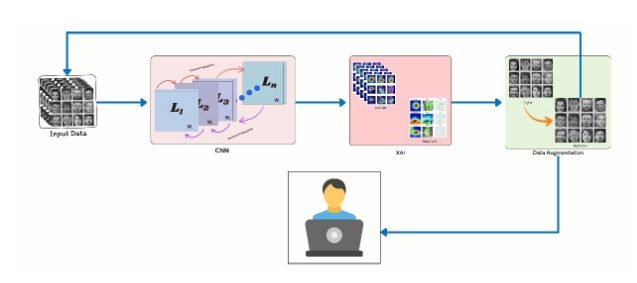
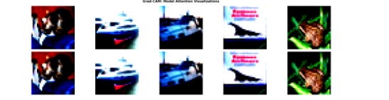

# XAI-Playground: A Data-Centric Framework for Explainable AI

[](LICENSE)
[](#)
[](#)

A research-oriented framework for building transparent image classification systems. This project shifts the focus from "black-box" model training to **Data-Centric AI**, using **Explainable AI (XAI)** insights to drive targeted data augmentation and error correction.

---

## Team
**Muhammad Bilal¹***, Danish Ahmad, Muhammad Umer, and Muhammad Husnain Abbas

 *Department of Software Engineering, GIK Institute of Engineering Sciences and Technology, Pakistan*


---

## Abstract
While deep learning models achieve high accuracy, their decision-making processes remain opaque. This project presents a four-phase framework:
1. **Intelligent Data Assessment** using priority-based search.
2. **Architecture Evaluation** (MobileNetV2, Efficient-CNN, ResNet-18).
3. **Interpretability Integration** (Grad-CAM, LIME, SHAP).
4. **Error-Driven Augmentation** guided by XAI.

Our findings demonstrate that using XAI to identify "blind spots" and applying targeted augmentation can yield up to a **+6.45% accuracy boost** on complex datasets like CIFAR-10.

---

## Framework Pipeline


*Figure 1: The four-phase methodology from data quality assessment to XAI-guided refinement.*

### 1. Model Architectures Evaluated
- **MobileNetV2:** Optimized for parameter efficiency using Depthwise Separable Convolutions.
- **Efficient-CNN:** A custom multi-branch architecture capturing features at 1x1, 3x3, and 5x5 scales.
- **ResNet-18:** A residual learning baseline focused on gradient stability and deep feature abstraction.

### 2. The XAI Suite
We implement three distinct layers of explainability:
* **Grad-CAM:** Class activation mapping to visualize spatial importance.
* **LIME:** Local surrogate models to explain individual predictions.
* **SHAP:** Game-theoretic approach (Shapley values) for global feature attribution.

---

## Performance & Experimental Results

### Accuracy Benchmarks
| Model | MNIST | Fashion-MNIST | CIFAR-10 | Final Gain (via XAI-Aug) |
| :--- | :---: | :---: | :---: | :---: |
| MobileNetV2 | 99.2% | 92.5% | 78.2% | **+3.12%** |
| Efficient-CNN | 99.5% | 93.4% | 80.1% | **+4.20%** |
| **ResNet-18** | **99.3%** | **92.8%** | **84.1%** | **+6.45%** |

### Visual Interpretability


*Figure 2: Heatmap analysis showing the shift in model focus before and after error-driven augmentation.*

---

## Key Research Insights
* **The Power of Scale:** Our custom **Efficient-CNN** multi-scale branch outperformed standard architectures on Fashion-MNIST, proving that capturing multi-resolution textures is key for clothing classification.
* **Beyond Accuracy:** Confusion matrix analysis revealed systematic failures (e.g., Cat vs. Dog). Using **SHAP**, we discovered the model was over-relying on background pixels, which we corrected through targeted background-invariant augmentation.
* **Efficiency vs. Stability:** While ResNet-18 was the most stable, MobileNetV2 achieved **90% of its performance with 80% fewer parameters**, highlighting its suitability for edge deployment.

---

## Repository Structure
```bash
XAI-Playground/
├── main.py                 # CLI Menu for training and XAI analysis
├── model_builder.py        # Architecture implementations (MobileNet, ResNet, Efficient-CNN)
├── data_processor.py       # Data cleaning and priority-based search algorithms
├── xai_analyzer.py         # Grad-CAM, LIME, and SHAP logic
├── consolidated_visualizer.py # Comparative performance plotting
├── requirements.txt        # Dependency list
